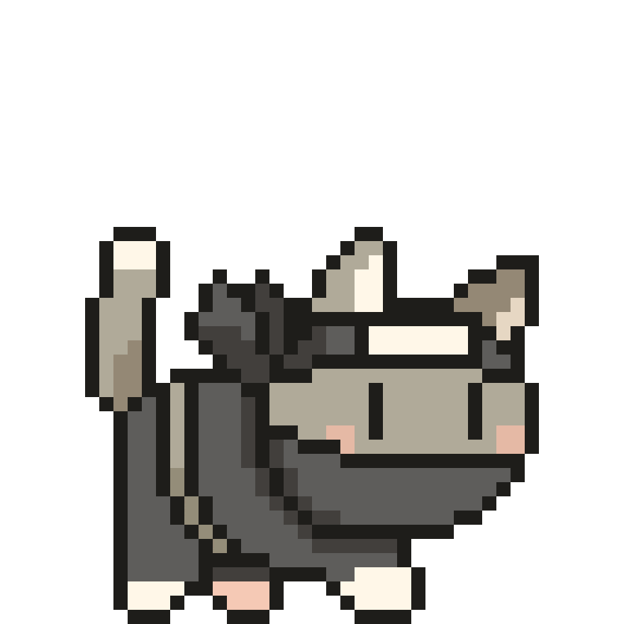
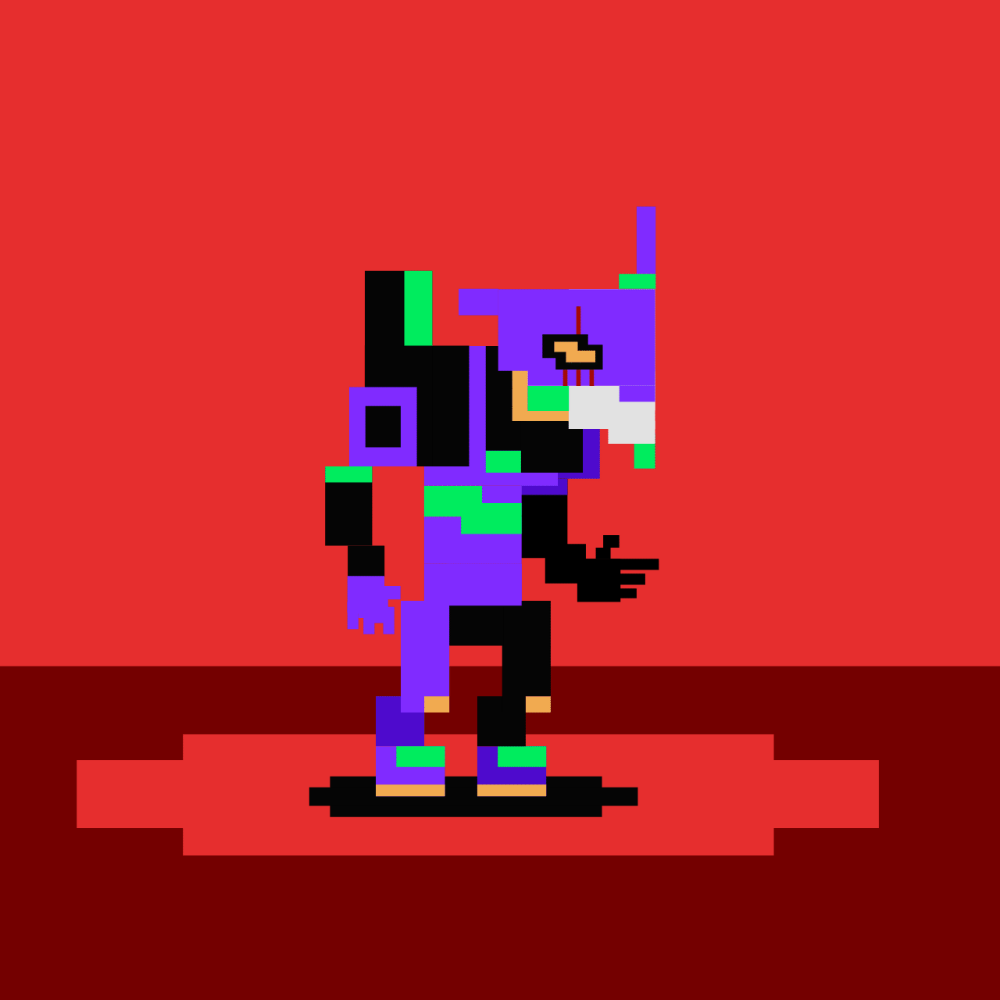
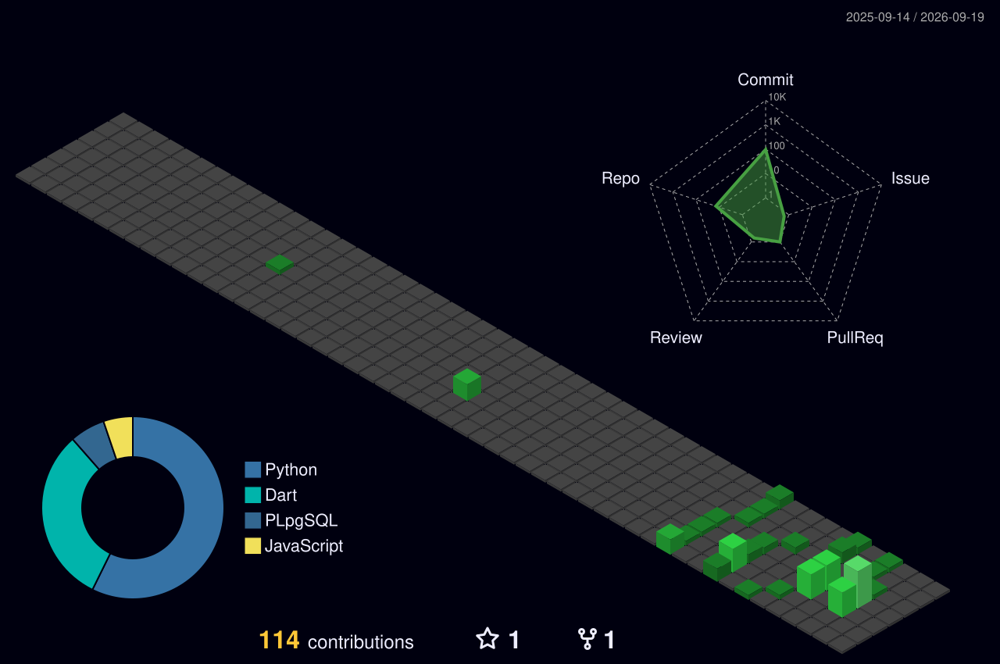

  

  

  

  
  
  
  
  
  
  
  
  

---

## Tech Stack

### Backend

   

### Frontend

   

### Mobile

 

### Database

   

### AI / ML

     

### DevOps & Tools

   

  

---

  

<h2 align="center">
  
  
  &nbsp;  GitHub Analytics &nbsp;
  
  
</h2>

  
  

  
  

  
  

 

  

---

## Featured Projects

<table>
  <tr>
    <td width="33%" valign="top">
      <h3> ExpenseFlow</h3>
      
Android-first personal expense tracker built with Flutter, Drift/SQLite, Riverpod and GoRouter.

    </td>
    <td width="33%" valign="top">
      <h3> JyotishAI</h3>
      
AI-powered Vedic astrology platform with a modular backend, RAG pipeline, vector search and provider-agnostic AI architecture.

    </td>
    <td width="33%" valign="top">
      <h3> AI Voice Receptionist</h3>
      
Intelligent voice-based reception system using LLMs and speech pipelines to handle inbound calls and queries autonomously.

    </td>
  </tr>
  <tr>
    <td width="33%" valign="top">
      <h3> SorryNotSorry</h3>
      
A social platform concept built around unfiltered authentic expression — no virtue signalling, just honesty.

    </td>
    <td width="33%" valign="top">
      <h3> KidsHub</h3>
      
A safe, curated digital learning space for children — interactive content, parental controls, and progress tracking.

    </td>
    <td width="33%" valign="top">
    </td>
  </tr>
</table>

---

  

  

